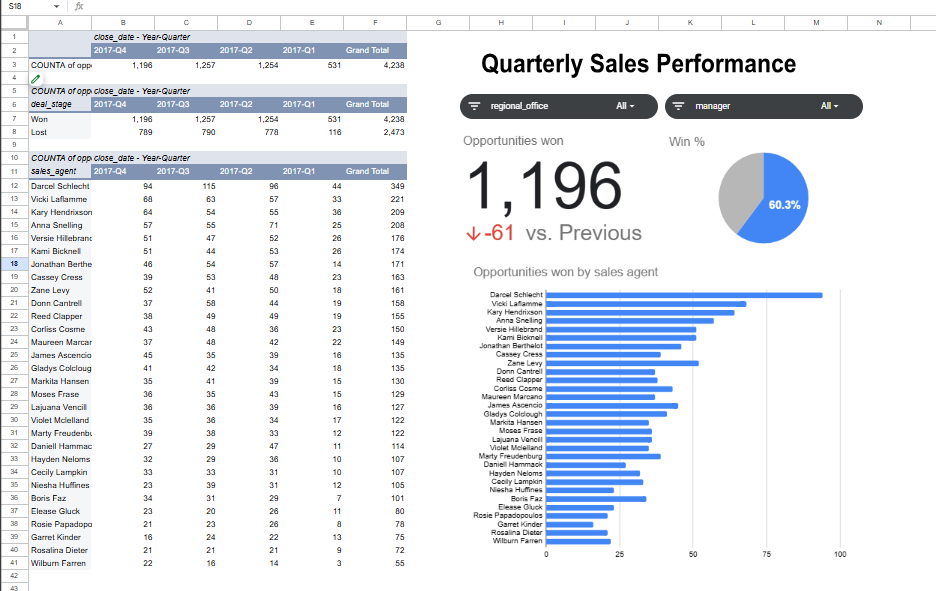

# CRM Sales Opportunities Analysis

## Project Overview

Analyzed CRM sales opportunity data from Maven Analytics to evaluate sales pipeline performance, conversion rates, product performance, and sales agent activity.

The goal of this guided project was to transform raw CRM data into actionable business insights that could help stakeholders better understand sales performance and identify opportunities for improvement.

## Business Questions

This analysis focused on questions such as:

* How is the sales pipeline performing?
* What percentage of opportunities are converted?
* Which products generate the most opportunities and revenue?
* Which sales agents are performing best?
* Where are the largest opportunities for improving sales performance?
* How does sales performance vary across different segments of the pipeline?

## Tools & Skills

* Excel
* Data Cleaning
* Exploratory Data Analysis
* KPI Analysis
* Sales Pipeline Analysis
* Data Visualization
* Business Intelligence

## Analysis Process

### 1. Data Preparation

Reviewed and cleaned the CRM dataset to ensure consistency and accuracy before analysis.

### 2. Exploratory Analysis

Analyzed opportunity outcomes, products, sales agents, and pipeline activity to identify trends and performance differences.

### 3. KPI Analysis

Evaluated key sales metrics including opportunity volume, conversion rate, and sales performance.

### 4. Visualization

Created visualizations to communicate important trends and make the findings easier for stakeholders to interpret.

## Key Insights

* [4,238 deals were won, generating approximately $10.0M in closed revenue.]
* [The West region generated the highest closed revenue at approximately $3.57M.]
* [GTXPro was the top revenue-generating product, contributing approximately $3.51M.]
* [Won deals accounted for about 48% of all opportunities, while 28% were lost.]

## Dashboard / Visualizations

## Project Files

| File                           | Description                                     |
| ------------------------------ | ----------------------------------------------- |
| `CRM_Sales_Analysis.xlsx`      | Excel workbook containing the analysis          |
| `sales_pipeline.csv`           | CRM sales opportunity data                      |
| `accounts.csv`                 | Account-level data                              |
| `sales_pipeline_dashboard.png` | Screenshot of the final visualization/dashboard |

## Project Source

Maven Analytics Guided Project — CRM Sales Opportunities

## Skills Demonstrated

Data Cleaning • Exploratory Data Analysis • KPI Development • Sales Analytics • Data Visualization • Business Insights
